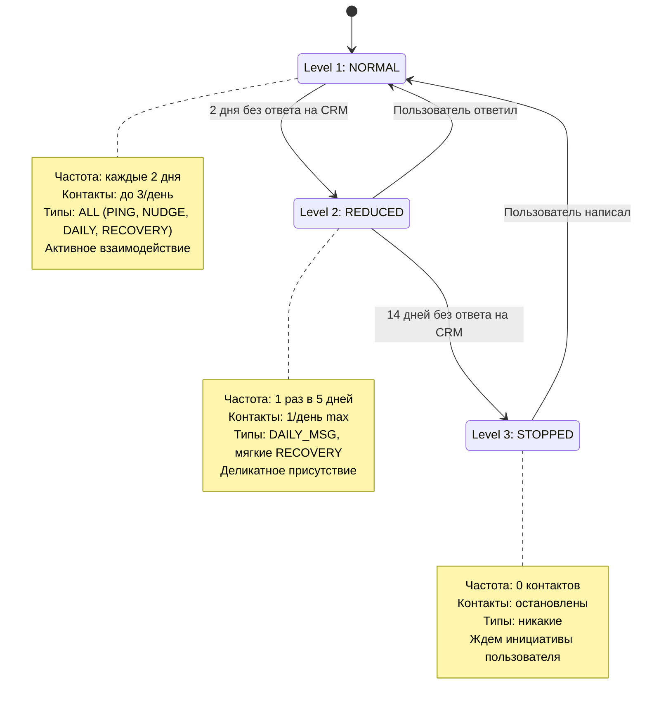
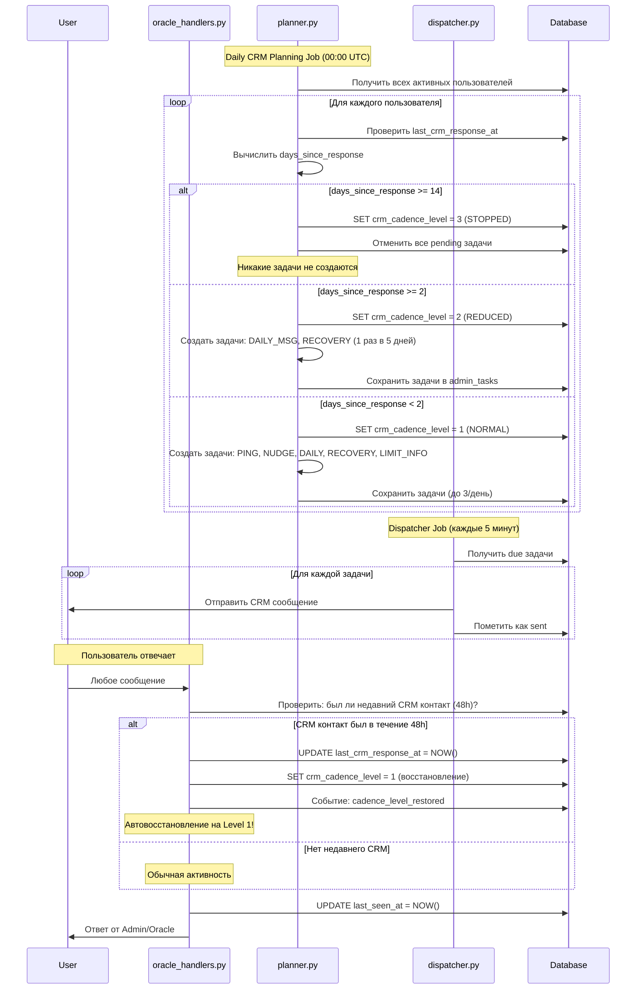
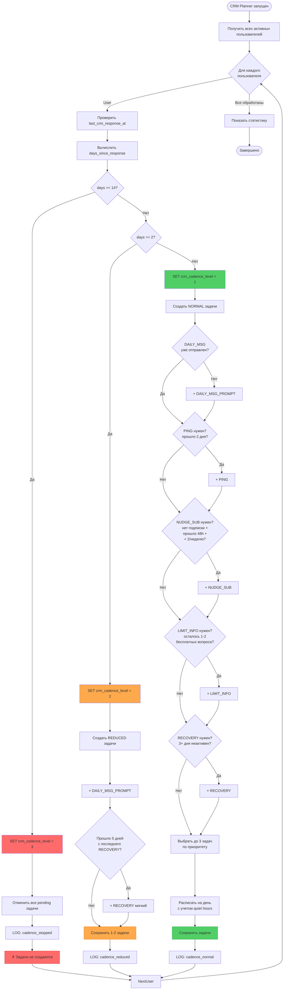
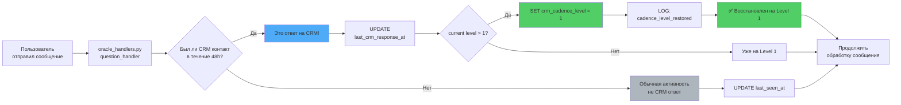

# 🎯 Адаптивная CRM система - Архитектура

## 📖 Определения уровней Cadence

### Level 1: NORMAL (Нормальный режим)
- **Триггер**: < 2 дней без ответа на CRM контакты
- **Частота**: каждые 2 дня, до 3 контактов/день
- **Типы задач**: ВСЕ (PING, NUDGE_SUB, DAILY_MSG, RECOVERY, LIMIT_INFO)
- **Описание**: Активное взаимодействие, полный CRM функционал

### Level 2: REDUCED (Сниженный режим)
- **Триггер**: 2-13 дней без ответа на CRM контакты
- **Частота**: 1 раз в 5-7 дней, до 1 контакта/неделю
- **Типы задач**: ТОЛЬКО DAILY_MSG_PROMPT + мягкие RECOVERY
- **Описание**: Деликатное присутствие, не давим на пользователя

### Level 3: STOPPED (Остановлен)
- **Триггер**: 14+ дней без ответа на CRM контакты
- **Частота**: 0 контактов (полная остановка проактивных сообщений)
- **Типы задач**: НИКАКИЕ (все CRM задачи отменяются)
- **Описание**: Уважение к границам, ждем инициативы пользователя
- **Важно**: Кнопки и команды работают, любая активность → восстановление на Level 1

### ⚡ Что считается "ответом на CRM"?
Любое сообщение пользователя в течение **48 часов** после отправки CRM контакта (PING, NUDGE_SUB, DAILY_MSG_PROMPT, RECOVERY, LIMIT_INFO).

### 🔄 Автовосстановление
При любом ответе на CRM или инициативе пользователя → мгновенное восстановление на Level 1.

---

## 📊 Диаграмма состояний (State Machine)



## 🔄 Последовательность работы (Sequence Diagram)



## 🌊 Блок-схема логики планирования (Flowchart)



## 🔔 Триггеры восстановления (Activity Diagram)



## 📦 Структура данных (ER Diagram)

```mermaid
erDiagram
    users ||--o{ admin_tasks : has
    users ||--|| contact_cadence : has
    users {
        int id PK
        int tg_user_id
        timestamp last_seen_at
        timestamp last_crm_response_at "NEW: последний ответ на CRM"
        int crm_cadence_level "NEW: 1=Normal, 2=Reduced, 3=Stopped"
        string crm_stopped_reason "NEW: почему остановлено"
        int free_questions_left
        bool is_blocked
    }

    admin_tasks {
        bigint id PK
        int user_id FK
        string type "PING, NUDGE_SUB, DAILY_MSG_PROMPT, RECOVERY..."
        string status "scheduled, due, sent, replied, failed"
        timestamp due_at
        timestamp sent_at
        jsonb payload
    }

    contact_cadence {
        int user_id PK_FK
        int days_between_pings
        int days_between_nudges
        jsonb prefers_windows
        int postpone_on_reply
    }

    events {
        bigint id PK
        int user_id FK
        string type "cadence_level_changed, cadence_stopped, cadence_restored"
        jsonb meta
        timestamp occurred_at
    }
```

## 🎮 Примеры сценариев использования

### Сценарий 1: Снижение активности
```mermaid
gantt
    title Пользователь перестал отвечать
    dateFormat YYYY-MM-DD
    axisFormat %d %b

    section Level 1
    Активный диалог           :done, l1, 2025-01-01, 5d
    CRM: PING отправлен       :crit, crm1, 2025-01-03, 1d
    Пользователь не ответил   :active, wait1, 2025-01-04, 2d

    section Level 2
    Переход на Level 2        :milestone, m1, 2025-01-06, 0d
    CRM: DAILY_MSG только     :crm2, 2025-01-08, 1d
    CRM: мягкий RECOVERY      :crm3, 2025-01-13, 1d
    Пользователь молчит       :active, wait2, 2025-01-06, 12d

    section Level 3
    Переход на Level 3        :milestone, m2, 2025-01-18, 0d
    Все CRM остановлены       :crit, stop, 2025-01-18, 5d
```

### Сценарий 2: Быстрое восстановление
```mermaid
gantt
    title Пользователь вернулся
    dateFormat YYYY-MM-DD
    axisFormat %d %b

    section Level 2
    Reduced режим             :done, l2, 2025-01-01, 5d
    CRM: RECOVERY отправлен   :crit, crm, 2025-01-04, 1d

    section Ответ
    Пользователь ответил!     :milestone, resp, 2025-01-05, 0d

    section Level 1
    Мгновенное восстановление :active, restore, 2025-01-05, 1d
    Normal режим возобновлен  :l1, 2025-01-06, 5d
    CRM: PING, NUDGE, DAILY   :crm2, 2025-01-07, 1d
```

## 🔧 Ключевые функции

### 1. Определение ответа на CRM
```python
async def is_response_to_crm(user_id: int) -> bool:
    """
    Проверяет был ли недавний CRM контакт (48h)
    и считается ли текущее сообщение ответом на него
    """
    last_crm = await get_last_crm_sent_time(user_id)
    if not last_crm:
        return False

    hours_since = (datetime.now() - last_crm).total_seconds() / 3600
    return hours_since <= 48
```

### 2. Обновление уровня cadence
```python
async def update_cadence_level(user_id: int) -> int:
    """
    Автоматически обновляет crm_cadence_level
    на основе last_crm_response_at
    """
    user = await UserModel.get_by_id(user_id)
    last_response = user.get('last_crm_response_at')

    if not last_response:
        return 1  # Default: Normal

    days_since = (datetime.now() - last_response).days

    if days_since >= 14:
        level = 3  # STOPPED
    elif days_since >= 2:
        level = 2  # REDUCED
    else:
        level = 1  # NORMAL

    await set_cadence_level(user_id, level)
    return level
```

### 3. Автовосстановление
```python
async def restore_cadence_on_response(user_id: int):
    """
    Восстанавливает Level 1 при ответе на CRM
    """
    current_level = await get_cadence_level(user_id)

    if current_level > 1:
        await set_cadence_level(user_id, 1)
        await set_last_crm_response(user_id, datetime.now())

        await EventModel.log_event(
            user_id=user_id,
            event_type='cadence_level_restored',
            meta={'from_level': current_level, 'to_level': 1}
        )

        logger.info(f"User {user_id} re-engaged! Restored from Level {current_level} to Level 1")
```

## 📈 Метрики и мониторинг

### События для аналитики:
- `cadence_level_changed` - изменение уровня
- `cadence_level_restored` - восстановление после неактивности
- `cadence_stopped` - полная остановка CRM
- `crm_response_detected` - обнаружен ответ на CRM

### Метрики для dashboard:
- % пользователей на каждом level (1/2/3)
- Среднее время на Level 2 перед восстановлением
- % пользователей восстановившихся с Level 3
- Эффективность CRM по уровням (response rate)

---

**Дата создания**: 2025-01-17
**Версия**: 1.0
**Статус**: Design Complete, Ready for Implementation
